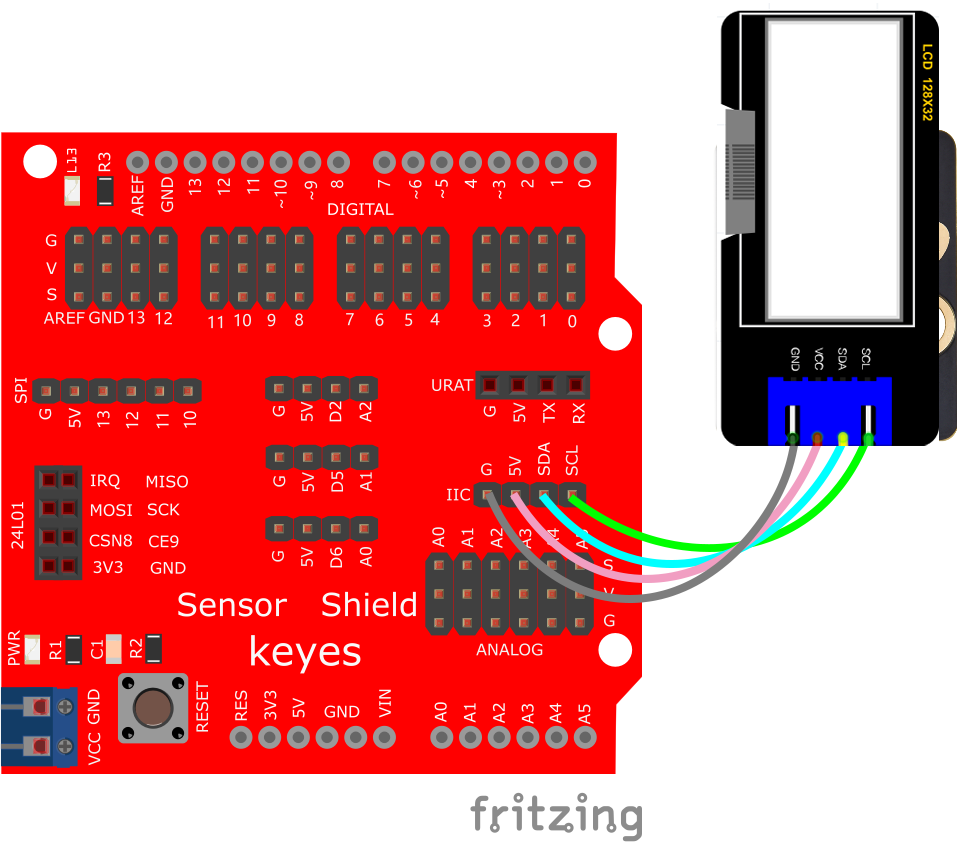
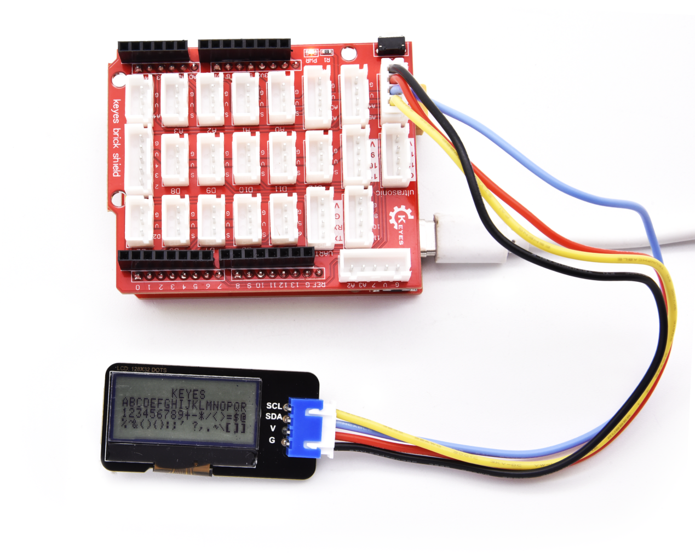

# Arduino


## 1. Arduino简介  

Arduino是一种开源电子原型平台，广泛使用于电子和编程教育。它以其简单的硬件和软件设计受到了许多爱好者和开发者的青睐。Arduino板通常基于微控制器，能够与各种传感器、执行器和显示设备进行连接和互动。用户可以使用Arduino IDE编写和上传代码，通过C/C++编程语言控制硬件的行为。  

Arduino支持多种开发模式，包括图形化编程和文本编程，适合不同程度的使用者。总之，Arduino不仅为简单的电子项目提供了基础，也为复杂的自动化和电子产品开发提供了强大的支持，创造了无数的创意和功能。  

## 2. 接线图  

  

## 3. 测试代码  

- 下载库文件: [Arduino](./Arduino.7z)

- 打开Arduino IDE，选择“项目”，选择“导入库”，再选择“添加.ZIP库”。

  

- 找到下载资料的存放位置，打开文件夹找到库文件，选择要导入的库，点击“打开”。

  

- 安装成功出现的界面。

  

```cpp  
#include <lcd.h> // 添加库文件  

lcd Lcd; // 定义Lcd类实例  

void setup() {  
    Lcd.Init(); // 初始化  
    Lcd.Clear(); // 清屏  
}  

void loop() {  
    Lcd.Cursor(0, 7); // 设置第一行，第八列开始显示  
    Lcd.Display("KEYES"); // 显示“KEYES”  
    Lcd.Cursor(1, 0);  
    Lcd.Display("ABCDEFGHIJKLMNOPQR");  
    Lcd.Cursor(2, 0);  
    Lcd.Display("123456789+-*/<>=$@");  
    Lcd.Cursor(3, 0);  
    Lcd.Display("%^&(){}:;'|?,.~\\[]");  
}  
```

## 4. 代码说明  

1. 首先导入库文件。  
2. `.init()`用于初始化显示屏；`.Clear()`清除显示内容；`.Cursor()`设置显示位置；`.Display()`显示指定字符。  

## 5. 测试结果  

上传测试代码成功后，按照接线图接好线路，利用USB上电后，128X32LCD模块显示屏的结果如下：  

- 第一行显示“KEYES”  
- 第二行显示“ABCDEFGHIJKLMNOPQR”  
- 第三行显示“123456789+-*/<>=$@”  
- 第四行显示“%^&(){}:;'|?,.~\[]”  




