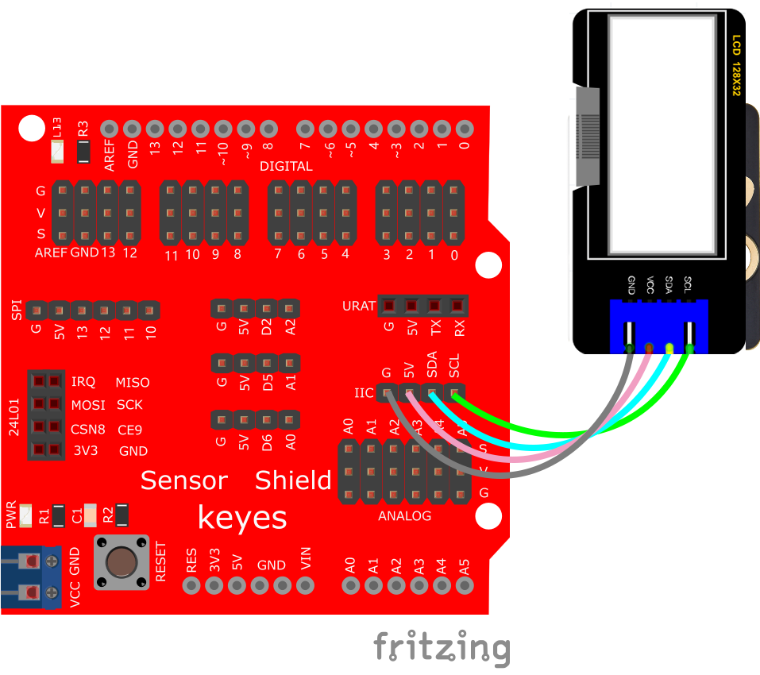
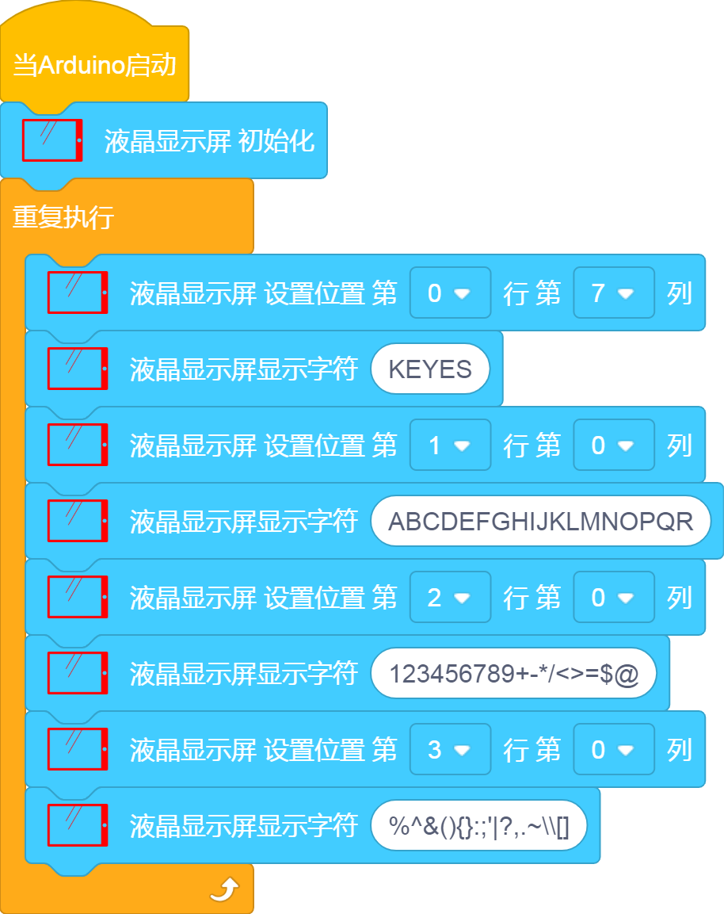
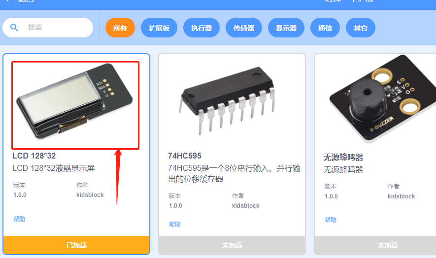
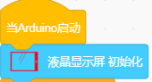
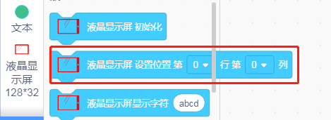
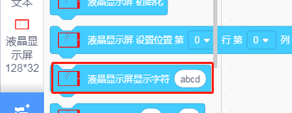
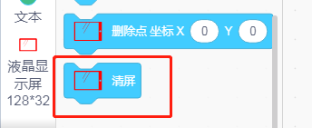
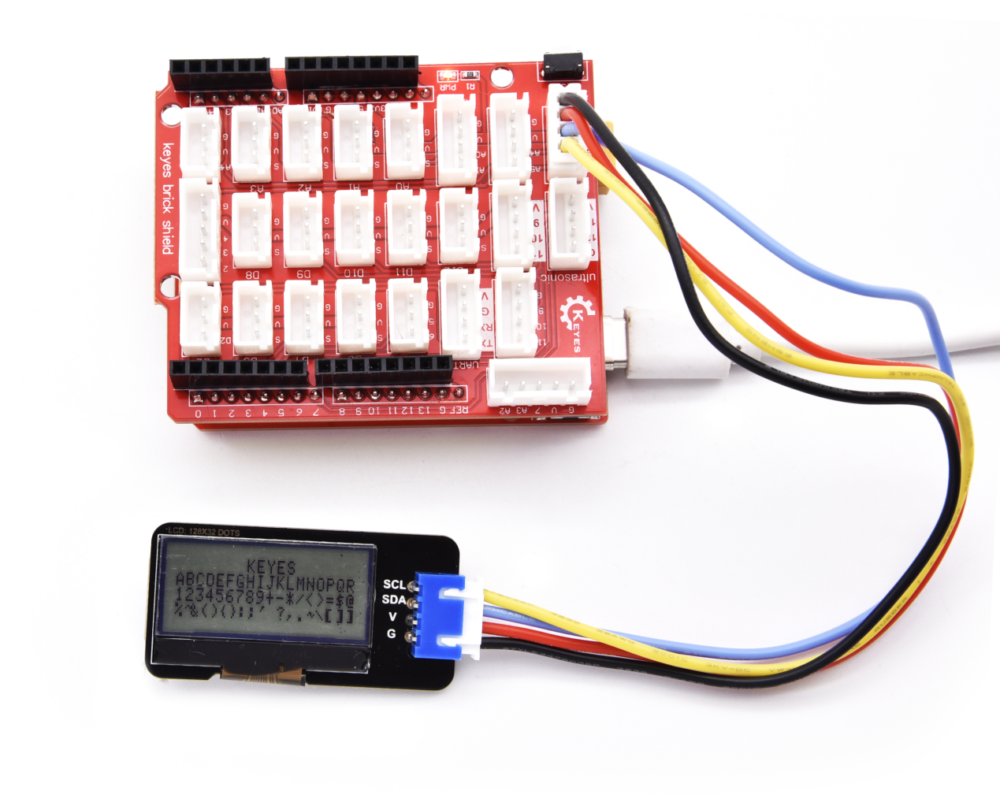

# KidsBlock

## 1. Kidsblock简介  

Kidsblock是一个图形化编程平台，旨在帮助初学者和儿童轻松学习编程和电子技术。通过拖放式的编程界面，Kidsblock使得用户能够快速创建互动项目，而无需深入理解复杂的编程语法。该平台兼容多种硬件设备，包括Arduino等，使得用户可以通过实践了解编程和电子系统的工作原理。  

Kidsblock的设计理念是亲切友好，适合所有年龄段的用户。它提供了丰富的模块和示例项目，鼓励用户在探索中学习，提高动手能力和创造性思维。同时，Kidsblock的社区和支持文档也为学习者提供了丰富的资源。  

## 2. 接线图  

  

## 3. 测试代码  

  

## 4. 代码说明  

（1）首先添加扩展128X32LCD模块  

  

为对128X32LCD模块进行初始化设置，这个模块是使用IIC通讯的，这里没有需要我们设置管脚，我们接线的时候连接IIC接口就可以了。  

（2）显示屏单元下再找到，这个代码块用来设置我们要显示的信息的位置，当我们设置好位置时，用这个代码块来显示内容，为清楚模块上的显示。  

## 5. 测试结果  

上传测试代码成功，按照接线图接好线，利用USB上电后，128X32LCD模块显示屏的结果如下：  

- 第一行显示“KEYES”  
- 第二行显示“ABCDEFGHIJKLMNOPQR”  
- 第三行显示“123456789+-*/<>=$@”  
- 第四行显示“%^&(){}:;'|?,.~\[]”  

