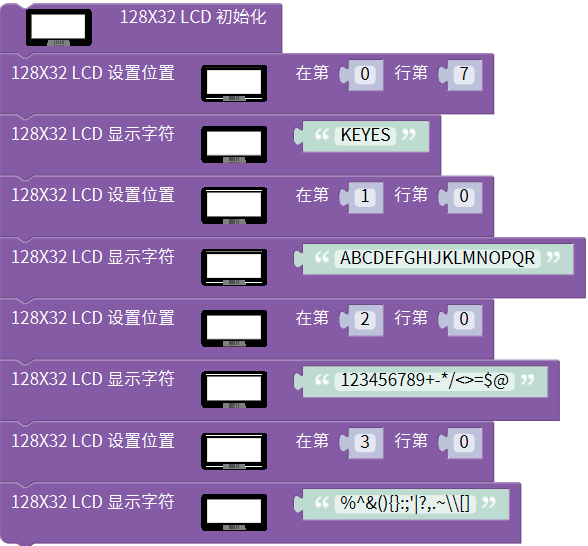
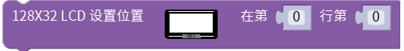
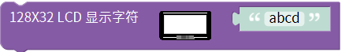

# Mixly

## 1. Mixly简介  

Mixly是一个图形化编程平台，专为初学者设计，特别是儿童和编程爱好者。该平台通过简单的拖放式界面，让用户能够轻松创建程序和互动项目，从而掌握编程和电子技术的基本概念。Mixly支持多种硬件，包括Arduino等主流开发板，使得用户能够在学习的同时动手实践，并快速构建各种有趣的电子项目。  

Mixly中包含丰富的模块和教程，帮助用户通过图形化的方式理解编程逻辑、控制硬件行为。该平台旨在激发用户的创造力，并培养他们的动手能力，让学习变得更加生动和有趣。  

## 2. 接线图  

  

## 3. 测试代码  

- 下载资料：[Mixly](./Mixly.7z)

- 点击“设置”---->“管理库”

  

- 选择本地导入，选择下载资源的库文件，选择库文件中的“.xml”后缀的文件导入。

  

  

## 4. 代码说明  

(1) 在库keyes sensor下的“显示模块”单元找到128X32LCD模块。 为对128X32LCD模块进行初始化设置，该模块使用IIC通讯，因此在接线时只需连接IIC接口，无需设置管脚。  

(2) 在同一单元下找到，该代码块用于设置显示内容的位置，设置好位置后，用此代码块来显示内容，而则用于清除模块上的显示。  

## 5. 测试结果  

上传测试代码成功后，按照接线图连接线路，利用USB上电后，128X32LCD模块显示屏的结果如图所示：  

- 第一行显示“KEYES”  
- 第二行显示“ABCDEFGHIJKLMNOPQR”  
- 第三行显示“123456789+-*/<>=$@”  
- 第四行显示“%^&(){}:;'|?,.~\[]”  

